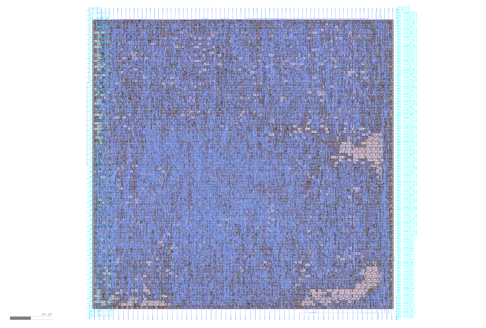

# Wishbone ChaCha Accelerator

This is an extremely simple, ChaCha20 accelerator for the MPW2-C [multi project
submission](https://github.com/mattvenn/multi_project_tools). The accelerator is
exposed to the Wishbone bus. The state of the accelerator consists of a
key-register, an iv/nonce-register, as well as a counter. The Wishbone bus
exposes an interface to shift 32-bit words in or out of the key/iv/counter
registers, and a status bit to check the status and initialize the permutation.
After the permutation is initialized, the key stream can be read in 32-bit
chunks. After 16 chunks are read, the counter is automatically incremented and
the next key stream block is generated. The core also exposes an (untested)
interrupt line, that can be en-/disabled via the status register.

# Requirements

- All the requirements for [multi project tools](https://github.com/mattvenn/multi_project_tools)
- The [cocotb](https://github.com/cocotb/cocotb) testbenches additionally require the [cocotb-bus](https://github.com/cocotb/cocotb-bus) library. They also utilize the [cocotbext-uart](https://github.com/alexforencich/cocotbext-uart) and [cocotbext-wishbone extensions](https://github.com/wallento/cocotbext-wishbone), which I have included in this repository.

# License

This project is [licensed under Apache 2](LICENSE)
